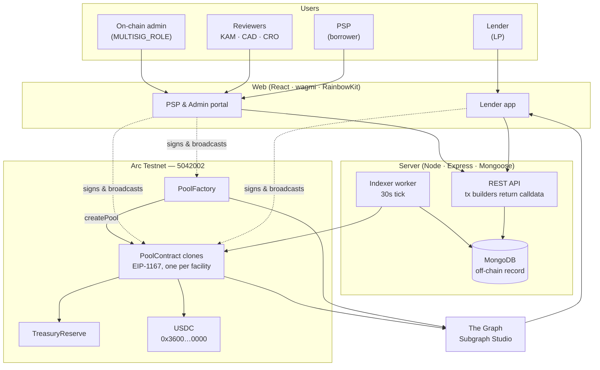
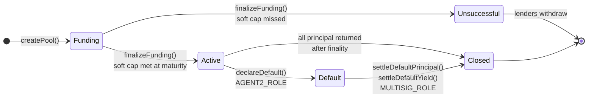
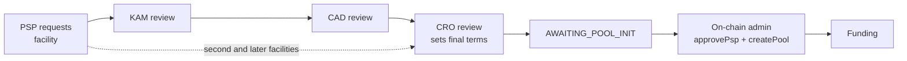
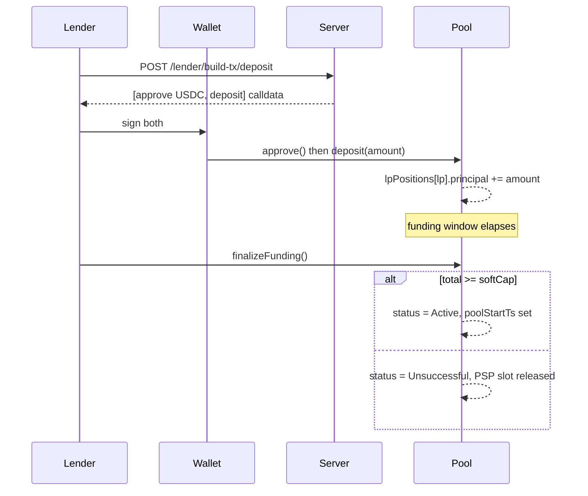
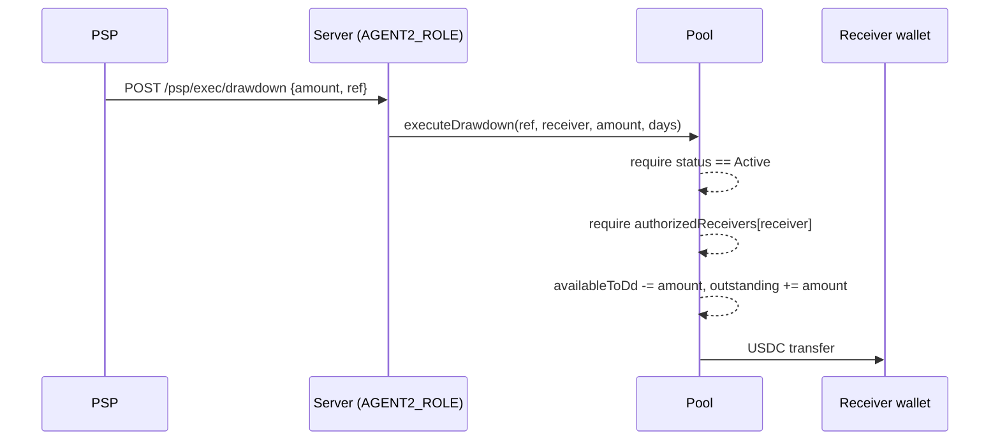
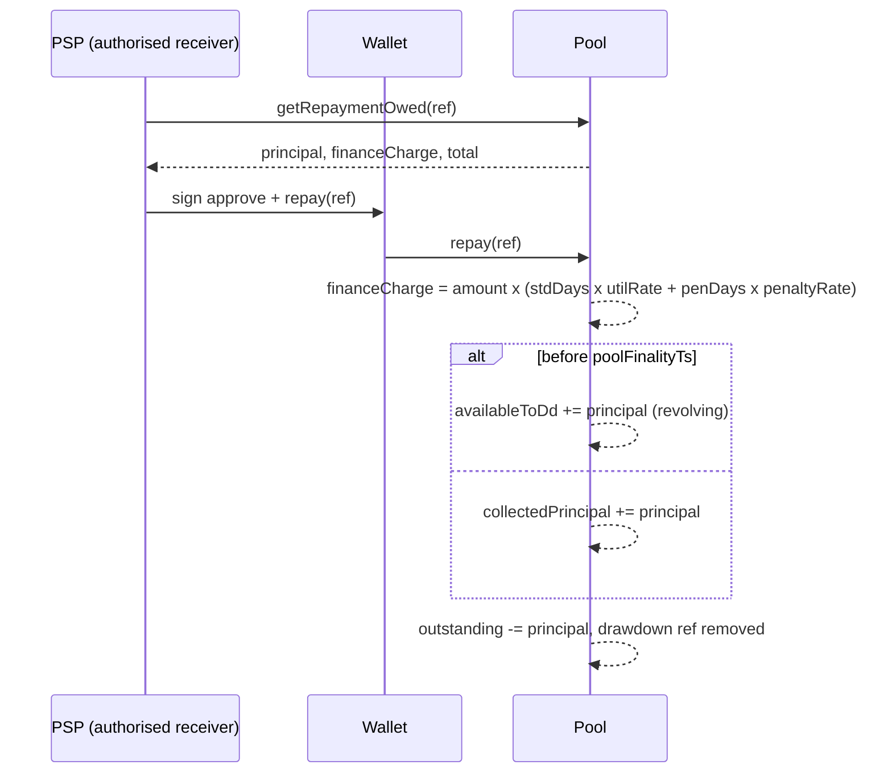
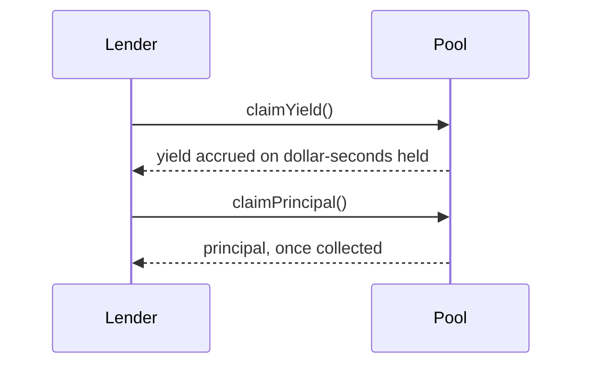
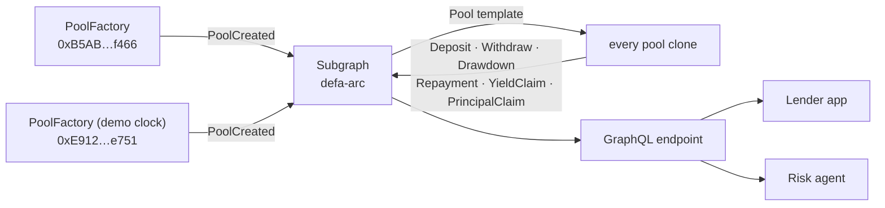

# DeFa — Architecture

**ETHOnline 2026 · Arc (chain 5042002) · Settlement in native USDC**

A secured revolving credit facility for payment service providers. Lenders
commit USDC to a facility; an approved PSP draws against it and repays with a
finance charge; lenders claim yield and principal. Every state transition that
moves money is a contract call — the backend builds calldata and indexes
results, but never holds funds and never authorises a release on its own.

---

## 1 · System context

**The key line is the dotted one.** The server never signs a user's
transaction. `POST /pool/**/build-tx/*` returns `{to, data, value}`; the
browser wallet signs and broadcasts it. The server holds one key only, for
`AGENT2_ROLE` (drawdown execution) and `AGENT1_ROLE` (pause, overdue flag) —
both of which are themselves gated on-chain.

---

## 2 · Components

| Path | What it is | Notes |
|---|---|---|
| `contracts/` | Foundry — `PoolFactory`, `PoolContract`, `TreasuryReserve` | Pools are EIP-1167 clones; one address per facility |
| `server/` | Express API, transaction builders, chain indexer | Stateless w.r.t. funds; Mongo is a cache and an off-chain record of approvals |
| `web/portal/` | PSP portal, credit-committee review, on-chain admin | wagmi + RainbowKit |
| `web/lender/` | Lender marketplace, deposit, redeem | wagmi + RainbowKit |
| `subgraph/` | The Graph — schema, manifest, mappings | Indexes both factories and every pool clone |
| `docs/` | This document, protocol mechanics, deployments | |

---

## 3 · Facility lifecycle

A facility is a contract. Its status is the contract's own enum, not a
database column — the database mirrors it.

Two timing rules decide almost everything:

- **`finalizeFunding()` cannot run early.** It requires
  `block.timestamp >= fMaturityTs`. The funding window always elapses in full,
  so a fully-subscribed pool still waits.
- **Repayment is revolving until finality.** Principal repaid *before*
  `poolFinalityTs` returns to `availableToDd` and can be drawn again; after
  finality it accrues to `collectedPrincipal` for lenders to claim.

`Unsuccessful` and `Closed` both release the PSP's factory slot, freeing them
to open a new facility.

---

## 4 · Approval chain

Money cannot move until a facility has cleared human review. The chain is
enforced server-side and recorded on the facility document; the on-chain admin
can only deploy a pool for a facility that reached `AWAITING_POOL_INIT`.

A PSP's **first** facility runs the full three-stage review. Once one facility
has been approved, later requests go straight to the CRO — the KAM and CAD
work is relationship-level, not per-facility.

---

## 5 · Money flows

### 5.1 Funding and activation

### 5.2 Drawdown — the one server-signed call

The server signs this one, but cannot decide it: `AGENT2_ROLE` is granted
on-chain, the receiver must already be authorised on the pool, and the amount
is bounded by `availableToDd`. A compromised server key cannot invent a
receiver or exceed the facility.

### 5.3 Repayment

Only an **authorised receiver** may repay — `repay()` checks
`authorizedReceivers[msg.sender]`, not the PSP wallet, so a facility can settle
from the same wallets it draws to.

### 5.4 Redemption

Yield accrues per **dollar-second**, so a lender is paid for capital actually
committed over time rather than for a snapshot balance.

---

## 6 · Roles and trust model

| Role | Held by | Can do | Cannot do |
|---|---|---|---|
| `MULTISIG_ROLE` | On-chain admin | Create pools, approve PSPs, settle defaults, sweep protocol fees | Move lender principal out of a healthy pool |
| `AGENT2_ROLE` | Server key | Execute drawdowns to **already-authorised** receivers, declare default | Add a receiver, exceed `availableToDd` |
| `AGENT1_ROLE` | Server key | Pause the pool, set the overdue flag | Move funds |
| Lender | Any wallet | Deposit, withdraw during funding, claim yield and principal | Touch another lender's position |
| PSP / receiver | Bound wallet | Repay | Draw down directly |

The borrower wallet is **stamped into the pool at creation and is immutable**.
It is bound off-chain by SIWE signature before the facility is deployed, which
is why binding is a hard prerequisite rather than a convenience.

---

## 7 · Data layer — The Graph

The schema is deliberately shaped to the **ERC-4626 vault standard** —
`Deposit` and `Withdrawal` carry the standard `sender` / `owner` / `assets` /
`shares` fields, and `Facility` exposes `asset`, `totalAssets` and
`totalSupply`. A facility is therefore readable by any tool that already
understands 4626 vaults, without bespoke knowledge of this protocol.

Pools are created at runtime as clones, so they cannot be listed statically;
they are indexed by **template**, instantiated from each `PoolCreated` event.

Two factories are indexed. The second is byte-identical except that
`MathLib.SECONDS_PER_DAY = 60`, so one contract "day" elapses in a real
minute and a 30-day facility completes in half an hour. Demo activity lives
there; indexing only the production factory produced a Subgraph that was
correct and completely empty.

**Endpoint:** `https://api.studio.thegraph.com/query/1760269/defa-arc/v0.0.1`

---

## 8 · Off-chain indexer

The server runs a second, private indexer. It exists for latency and for
joins the Subgraph is not the right place for — matching an on-chain pool back
to the off-chain facility document that carries the credit memo and approval
history.

It reconciles on every tick rather than trusting a rolling event window: a
pool created while the worker was down is still bound, because
`factory.psps()` is authoritative and has no window. One pool belongs to
exactly one facility.

---

## 9 · Network

| | |
|---|---|
| Chain | Arc Testnet `5042002` · `https://rpc.testnet.arc.io` |
| Explorer | [testnet.arcscan.app](https://testnet.arcscan.app) |
| Settlement asset | USDC — Arc's native gas token, exposed as a 6-decimal ERC-20 at `0x3600000000000000000000000000000000000000` |

USDC is both the gas token and the unit of account. Gas is quoted in 18
decimals, balances in 6 — a distinction worth holding on to when reading
amounts.

Contract addresses: [`DEPLOYMENTS.md`](./DEPLOYMENTS.md).
Protocol mechanics — fees, waterfall, invariants: [`PROTOCOL.md`](./PROTOCOL.md).
