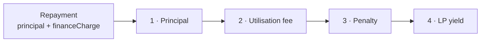

# DeFa — Protocol mechanics

**ETHOnline 2026 · Arc**

How the numbers work: what a facility charges, who is paid in what order, and
which invariants the factory refuses to deploy without. Architecture and
diagrams live in [`ARCHITECTURE.md`](./ARCHITECTURE.md).

All rates are WAD-scaled (1e18) **per day**. All amounts are USDC base units
(6 decimals).

---

## 1 · The two sides of a facility

A facility is a fixed-term pool with a revolving credit line inside it.

- **Lenders** commit USDC during a funding window and are paid a yield.
- **The PSP** draws against the committed capital and repays with a finance
  charge, as many times as it likes, until the facility's finality date.

Capital repaid before finality becomes drawable again. That is the revolving
part, and it is why the facility charges for *availability* as well as for
*use*.

---

## 2 · Three charges

| Charge | Rate | Basis | Paid when |
|---|---|---|---|
| **Utilisation** | `utilizedRateDaily` | Drawn amount × days drawn | On repay |
| **Idle / commitment** | `idleRateDaily` | Undrawn `availableToDd` × calendar days | Accrues daily, settled from repayments |
| **Penalty** | `penaltyRateDaily` | Drawn amount × days past grace | On repay |

### Utilisation and penalty

Computed together at repayment, splitting the elapsed days at the penalty
boundary:

```
stdDays  = min(daysElapsed + 1, penaltyStartDay)     // floored at minDdDays
penDays  = max(daysElapsed + 1 - penaltyStartDay, 0)

financeCharge = principal × (stdDays × utilizedRateDaily
                           + penDays × penaltyRateDaily) / WAD
```

`penaltyStartDay` is the drawdown's own due day plus `penaltyGraceDays`. A
drawdown repaid inside its term pays only the utilisation rate; one left
outstanding keeps accruing at the penalty rate with no cap, which is deliberate
— see §6.

### Idle fee

Billed per **complete calendar day** on capital sitting undrawn, from
`poolStartTs` up to the day before `poolFinalityTs`. Capital returned by a
repayment is **exempt for the remainder of that calendar day**
(`idleExemptAmount` / `idleExemptUntil`), so a PSP that repays and redraws the
same day is not billed twice for the same dollar.

---

## 3 · Yield: dollar-seconds, not balances

Lender yield accrues on **dollar-seconds** — principal integrated over the time
it was actually committed — rather than on a balance snapshot. A lender who
deposits late in the funding window earns proportionally less than one who
committed on day one, with no special-casing.

`claimYield()` and `claimPrincipal()` are separate calls: yield is claimable
while the facility runs, principal once it has been collected.

---

## 4 · Repayment waterfall

Incoming repayment is applied in a fixed order:



Principal is made whole first. Lender yield is last, which is the honest
ordering for a credit product: the fee that pays the protocol cannot be taken
ahead of the capital it was charged on.

Before `poolFinalityTs`, repaid principal returns to `availableToDd`. After it,
principal accrues to `collectedPrincipal` and is claimable by lenders.

---

## 5 · Invariants the factory enforces

`createPool()` refuses parameters that cannot work, rather than deploying a
facility that fails later.

### APR coverability

The advertised lender APR must be coverable by the utilisation rate over the
worst-case life of the facility:

```
aprAnnual × maxTenureSecs  ≤  utilizedRateDaily × 365 × tenure × SECONDS_PER_DAY

maxTenureSecs = fundingDurationSecs
              + snapSecs                  (alignment to the day boundary)
              + fundingExecBufferDays
              + tenure × SECONDS_PER_DAY
              + penaltyGraceDays × SECONDS_PER_DAY
```

> **`maxTenureSecs` includes the funding window.** A long funding window
> lengthens the period the APR must be covered over and can fail this check on
> otherwise sensible terms. On the demo clock — where a day is 60 seconds — a
> one-hour funding window reads as 60 days and will be rejected.

### Envelope bounds

Every economic term is checked against a factory-level `envelope`: minimum and
maximum APR, tenure, grace days, idle rate, utilisation rate, penalty rate, and
a hard-cap ceiling. Terms set by the CRO are bounded by what the protocol
allows, not merely by what the form accepts.

### One live pool per PSP

`psps[wallet].activePool` must be zero to create a pool. The slot is released
when a facility reaches `Unsuccessful` or `Closed`. `reassignPspWallet()` moves
an approval to a new wallet and deletes the old record — which also clears the
old wallet's approval.

---

## 6 · Default

`declareDefault()` (`AGENT2_ROLE`) moves a facility to `Default`. Recovery is
then a `MULTISIG_ROLE` operation in two ordered steps:

1. `settleDefaultPrincipal()` — principal must be made whole first
2. `settleDefaultYield()` — refuses until `collectedPrincipal >= principal`

Shortfalls are covered from `TreasuryReserve`. The facility closes when the
waterfall is satisfied, releasing the PSP slot.

Penalty accrual is uncapped by design: an unrepaid drawdown is meant to become
expensive without bound, so that defaulting is never cheaper than repaying.
On the demo clock this compounds in real minutes — a drawdown left open over a
weekend can owe many times its principal, which is correct behaviour observed
at unusual speed.

---

## 7 · Lifecycle timing

| Timestamp | Meaning |
|---|---|
| `fundingStartTs` | Pool created, deposits open |
| `fMaturityTs` | `fundingStartTs + fundingDurationSecs` — funding closes |
| `poolStartTs` | Set at activation; idle billing begins |
| `poolFinalityTs` | Revolving ends; repaid principal stops being redrawable |

`finalizeFunding()` requires `block.timestamp >= fMaturityTs`. There is no
early lock: a pool that hits its hard cap in the first minute still waits out
the window. Soft cap met at maturity → `Active`; missed → `Unsuccessful` and
every lender withdraws.

---

## 8 · Authorised receivers

Drawdowns pay out to an **authorised receiver**, not automatically to the PSP
wallet, and `repay()` checks the same list. A facility can therefore disburse
to a settlement account and be repaid from it, while `AGENT2_ROLE` — the one
role the server holds — cannot add a receiver.

The PSP's own wallet is bound off-chain by SIWE signature and stamped into the
pool at creation. It is immutable afterwards: rebinding is permitted only while
no pool exists.

---

## 9 · Reading amounts

USDC on Arc is the native gas token exposed as a 6-decimal ERC-20. Gas values
are 18-decimal; balances and all protocol amounts are 6-decimal. A bare integer
in a transaction builder is already in base units — `20` is 0.00002 USDC, not
20 USDC.
